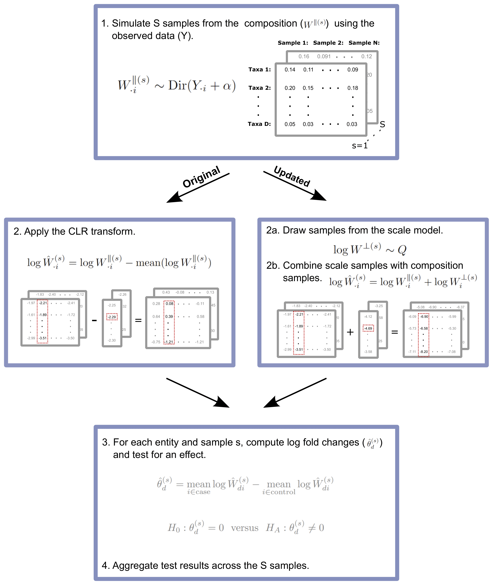

# Introduction to Scale Simulation using `ALDEx2`

`ALDEx2` is a popular software for fitting linear models on sequence count data developed by @fernandes:2013. It attempts to model how the abundance (or expression) of entities changes between different biological conditions. As a special case, `ALDEx2` is a method for differential expression or differential abundance when the covariate of interest is binary. 

In short, the method works by testing Centered log-ratio (CLR)-transformed Dirichlet samples. Succinctly, for each entity (e.g., gene or taxa) $j$, it proceeds by:

1. Adding a small prior count to the observed counts for taxa $j$ across all samples.
2. Drawing Monte Carlo samples using the Dirichlet distribution.
3. Transforming the samples using the Centered log ratio (CLR) transform.
4. Fitting a model using the covariates of interest and testing a hypothesis (e.g., t-tests in the case of differential expression/abundance).
5. Averaging across test statistics and p-values to test significance for each entity.

The average test statistic and p-value^[Corrected p-values using either the Benjamini-Hochberg or Holm procedure are also returned.] for each entity is returned and typically used by the end user to judge the significance of certain covariates on each taxa.

Step 3 of `ALDEx2` relies on transforming the Dirichlet samples, which necessarily sum to one, to CLR coordinates. As noted by @nixon:2022, this can introduce a mismatch between the research question and the actual analysis that is carried out. To see this concretely, consider the case where we have access to a sequence count data set $Y$, which is a $D \times N$ matrix where $D$ is the number of entities and $N$ is the number of samples. $Y$ is a sample of some underlying system $W$. For example, in a study of the human gut, $Y$ denotes the sequenced microbes obtained from a fecal sample whereas $W$ represents the actual microbes that occupy the gut.

The scale of $Y$ does not match the scale of $W$ but rather is more reflective of the measurement process (@Props:2017, @Vandeputte:2017). This is problematic when the research question depends on the scale of $W$ but is inferred from $Y$ alone. For example, consider the case where the analyst wants to estimate log-fold changes between two conditions:

$$\theta_d = \text{mean}_{x_i\text{ in group 1}} \log W_{di} - \text{mean}_{x_i \text{ in group 2}} \log W_{di}.$$
However, when using CLR coordinates, something different is estimated:

$$\tilde{\theta}_d = \text{mean}_{x_i\text{ in group 1}} \text{CLR}( Y_{di}) - \text{mean}_{x_i \text{ in group 2}} \text{CLR}( Y_{di}).$$

Note that $\tilde{\theta}_d$ is not necessarily an estimate of $\theta_d$ but something different: it is an estimate of the change in CLR coordinates of entity $d$ between conditions *not* an estimate in the change of the absolute abundances of entity $d$ between conditions. In fact, if $\tilde{\theta_d}$ is used as an estimate of $\theta_d$, a very specific assumption is being made equating the scale of the system to a function of the geometric mean of the observed data. Furthermore, this is being assumed with complete certainty which may skew analysis results. See @nixon:2022 for complete details.

While other normalizations are available within the ALDEx2 software, they similarly impose certain assumptions about the scales between conditions. In this vignette, we show how to step away from normalizations and instead rely on scale models for analysis.

## From Normalizations to Scale Models

Introduced and developed in @nixon:2022, scale simulation argues that many different types of analyses (including differential expression) are *scale reliant*, meaning that they inherently rely on the scale (e.g., total) of the system under study. Ignoring the scale can lead to incorrect inference or results that might not answer the right question.

To circumvent this, @nixon:2022 develops *scale simulation random variables* (SSRVs) which, in essence, provides the framework to directly incorporate scale uncertainty in the modeling process and, in doing so, can greatly improve inference (i.e., control Type-I error). In addition, they develop the methodology to incorporate scale simulation within the context of ALDEx2.

In brief, SSRVs replace normalizations with draws from a scale model. To see this concretely, lets consider the case of log fold changes. That is, we want to estimate $\theta_d$ from the previous section. As discussed, this quantity depends on the scale of the system $W$. We can decompose $W$ into both a compositional (denoted by the superscript $\parallel$) and total (denoted by the superscript $\perp$) component:

$$W_{dn} = W_{dn}^{\parallel}W^{\perp}_{n}$$

where we can define each component as:

\begin{align}
  W^{\perp}_{n} &= \sum_{d=1}^{D}W_{dn} \nonumber\\
  W^{\parallel}_{dn} &= \frac{W_{dn}}{W^{\perp}_{n}}.
\end{align}

SSRVs rely on two models: a \textit{measurement model} (which models $W^\parallel$) and a \textit{scale model} (which models $W^\perp$). That is, we take draws from the measurement model based on the available data $Y$ to get samples of $W^\parallel$ and draws from the scale model $W^\perp$ and combine them together to get draws for $W$.

Scale simulation subtly (but importantly) changes ALDEx2 in Step 3 above. After drawing Monte Carlo samples from the Dirichlet distribution (which denotes the measurement model for $W^\parallel$), scale simulation augments these samples with samples drawn from the scale model (as opposed to apply the CLR). This results in samples that better represent the scaled samples. See @nixon:2022 for complete details.

{width=90%}

How do we define and draw from a scale model? There are many options including:

1. Creating a scale model based on biological knowledge (e.g., bounds on the total number of microbes in the gut).
2. Creating a scale model based on outside measurements (e.g., flow cytometry or qPCR).
3. Creating a scale model that relaxes existing normalizations.

In this vignette, we show how to create each type of scale model. For convenience, we have included a default scale model based on the CLR normalization that requires only the input of a single number. For a single binary covariate, this scale model has the form:

\begin{align*}
	 \log \hat{W}_{n}^{\perp(s)} &= - \log \phi \left(\hat{W}^{\parallel (s)}_{\cdot n}\right) + \Lambda^{\perp (s)} X_{n}^*\\
	 \Lambda^{\perp (s)} & \sim \ N(0, \gamma^2).
\end{align*}

where $X_n^*$ is re-coded to have levels zero and one. Note that if $\gamma \rightarrow 0$, this scale model defaults to the CLR assumption. As $\gamma$ increases, more uncertainty is added. This can be incorporated by setting by updating the `gamma` parameter in the `aldex` and `aldex.clr` functions. For example, to set $\gamma$ equal to one, we would specify `gamma = 1`.

As we will show, $\gamma$ can also be set to a $N \times S$ matrix where $N$ is the number of samples and $S$ is the number of Monte Carlo replicates. This approach assumes that each row of the matrix represents draws from the total model for a given sample. These draws are internally log transformed and combined with the Multinomial Dirichlet draws to obtain samples for $W$.

# Using Scale Simulation in `ALDEx2`

## Installing `ALDEx2` with Scale Simulation

Currently, scale simulation within ALDEx2 is implemented in the `ALDEx_bioc` development branch on Github which can be installed using the `devtools` package if needed.

```{r installScaleSim, warning = FALSE, message = FALSE}
##If needed, install devtools
##install.packages("devtools")
##devtools::install_github("ggloor/ALDEx_bioc")
library(ALDEx2)
set.seed(1234)
```

## Simulation Setup

For this vignette, we are going to use a simulated data set. We consider a hypothetical scenario where a researcher is interested in how administering an antibiotic changes the abundance of taxa in the gut. To this end, they collected 100 samples both before and after antibiotic administration. Each sample contained the counts for 20 taxa.

In this simulation, we assume four of the 20 taxa are truly changing. Of the four taxa that are changing, they are all decreasing after antibiotic administration.

We are going to use Poisson sampling to sample the true abundances given a mean vector. First, writing a helper function to sample for the true abundances. 

```{r dataSim1, message = FALSE, warning = FALSE}
library(tidyverse)
##Function to create the true abundances via Poisson resampling
create_true_abundances <- function(d, n){
  dd <- length(d)/2
  dat <- d %>%
    sapply(function(x) rpois(n, lambda=x)) %>%
    t() %>%
    as.data.frame() %>%
    split(rep(1:2, each=dd)) %>%
    purrr::map(~`rownames<-`(.x, paste0("Taxa", 1:dd))) %>%
    purrr::map(t) %>%
    do.call(rbind, .) %>%
    as.data.frame() %>%
    cbind(Condition=factor(rep(c("Pre", "Post"), each=n), levels = c("Pre", "Post")), .) %>%
    `rownames<-`(., NULL)
  return(dat)
}
```

Second, to reflect the loss of scale information, we use multinomial sampling to resample the data to an arbitrary sequencing depth. Again, writing a helper function.

```{r dataSim2, message = FALSE}
##Function to resample data to an arbitrary size
resample_data <- function(dat, seq.depth){
  ddat <- as.matrix(dat[,-1])/rowSums(as.matrix(dat[,-1]))
  for (i in 1:nrow(dat)){
    dat[i,-1] <- rmultinom(1, size=seq.depth, prob=ddat[i,])
  }
  return(dat)
}
```

Now, we will use these functions to simulate data. Note that `dat` is analogous to $W$, and `rdat` is analogous to $Y$. To be clear, only four elements of `d` are chaning between conditions
```{r dataSim3, message = FALSE}
###Setting the data parameters for the simulation
##Denotes the mean for the 20 taxa
##Note only taxa 3, 4, 15, and 20 change
d.pre <- c(4000, 4000, 4000, 4000, 4000, 400,400,400,400,4000,400,500,500,500,400,400,400,400,400,400)
d.post <- d.pre
d.post[c(3,4,15,20)] <- c(3000, 2000, 200, 100)

#Combining together
d <- c(d.pre, d.post)

##Create scale abundances
dat <- create_true_abundances(d, n=100)
##Create resampled data
rdat <- resample_data(dat, seq.depth=5000)
```


Now, we need one more piece of information: the totals for each sample. We are going to use this to create mock flow cytometry data.

```{r dataSim5, message = FALSE}
## Finding sample totals
totals <- rowSums(dat[,-1])

flow_cytometry <- function(totals, samp.names, replicates = 3){
  samp.names <- rep(samp.names, each = replicates)
  flow_vals <- sapply(totals, FUN = function(totals, replicates){rnorm(replicates,totals,3e2)}, replicates = replicates, simplify = TRUE)
  flow_data <- data.frame("sample" = samp.names, "flow" = c(flow_vals))
  return(flow_data)
}

flow_data <- flow_cytometry(totals, rownames(dat))
```

Now, we have all the necessary pieces to run our models. Inspecting the data elements:

```{r dataElements}
##Inspecting elements
Y <- t(rdat[,-1])
Y[1:5,1:5]

conds <- as.character(rdat[,1])
conds

head(flow_data)
```

## Incorporating Scale in `ALDEx2`

With all these pieces in hand, we are ready to show how scale can be added to `ALDEx2`. We are going to walk through three different types of total models:

1. The default scale model
2. A measurement-based scale model
3. A knowledge-based scale model

Recall that we know which taxa are truly changing: taxa 3, 4, 15, and 20. We can use this to understand the performance of the different methods.

### Default Scale Model

First, we are going to run ALDEx2 as it was originally implemented. This can be achieved by setting `gamma = NULL`.

```{r defaultModel, message = FALSE}
## Original ALDEx2
mod.base <- aldex(Y, conds, gamma = NULL)
mod.base %>% filter(we.eBH < 0.05)
```

Note that all of the taxa are returned as significant. This leads to an elevated false discovery rate (FDR) of 80%!

Next, we are going to recreate these results using the default scale model. To do this, we are going to set $\gamma$ to some arbitrarily small value. This represents a very minimal level of uncertainty in the CLR assumption. To do this, we set `gamma = 1e-3`.

```{r defaultModel2, message = FALSE}
## Recreating ALDEx2
mod.clr <- aldex(Y, conds, gamma = 1e-3)
mod.clr %>% filter(we.eBH < 0.05)
```

To show that the effect sizes are identical, we will plot them from each of the two models above. Note how they fall on a straight line. Any small differences are due to Monte Carlo sampling error.

```{r defaultModel3, message = FALSE}
plot(mod.base$effect, mod.clr$effect, xlab = "Original ALDEx2 Effect Size", ylab = "Minimal Noise Effect Size")
abline(a=0,b=1, col = "red", lty = "dashed")
```

Next, we will show how adding some noise can greatly improve inference. Let's set `gamma = .25`.

```{r defaultModelNoise, message = FALSE}
## Adding noise
mod.ss <- aldex(Y, conds, gamma = .25)
mod.ss %>% filter(we.eBH < 0.05)
```

Remarkably, all false positives are gone! Three of the true positives are still retained.
Note that as $\gamma \rightarrow \infty$, all taxa will drop out as significant. Basically, if we are unwilling to any statement about the scales, we cannot make any conclusion as to how the absolute abundances are changing between conditions. 

```{r defaultModelNoise2, message = FALSE}
## Adding noise
mod.coda <- aldex(Y, conds, gamma = 1)
mod.coda %>% filter(we.eBH < 0.05)
```

### Measurement-Based Scale Model

Next, we are going to show how we can use outside measurements to create scale models. Here, we will rely on the simulated flow cytometry data. If we let \(z_{1n}, z_{2n}, z_{3n}\) denote the three cytometry measurements from each sample, we are going to specify a scale model of the form:

\[\hat{W}^{\perp (s)}_{n} \sim N(\text{mean}(z_{1n}, z_{2n}, z_{3n}),\text{var}(z_{1n}, z_{2n}, z_{3n})).\]

First, we need to extract the mean and standard deviation of the measurements for each sample.

```{r measureMod}
flow_data_collapse <- flow_data %>%
  group_by(sample) %>%
  mutate(mean = mean(flow)) %>%
  mutate(stdev = sd(flow)) %>%
  select(-flow) %>%
  ungroup() %>%
  unique()
```

Second, we will simulate draws from the scale model for each sample.

```{r measureModSamps}
scale_samps <- matrix(NA, nrow = 200, ncol = 128)
for(i in 1:nrow(scale_samps)){
  scale_samps[i,] <- rnorm(128, flow_data_collapse$mean[i], flow_data_collapse$stdev[i])
}
```

Finally, we will feed these into the `aldex` function. 

```{r measureModFit, message = FALSE}
mod.flow <- aldex(Y, conds, gamma = scale_samps)
mod.flow %>% filter(we.eBH < 0.05)
```

Remarkably, there are no false positives whereas all true positives are returned as significant.

### Knowledge-Based Scale Model

For our final scale model, suppose that we do not have access to our flow cytometry measurements, but previous literature and researcher intuition lead us to believe that there is a 10% decrease in the scale after antibiotic administration. We can encode this in a scale model:

```{r knowModSamps}
scale_samps1 <- matrix(rnorm(100*128, mean = 5, sd = 1),ncol = 128)
scale_samps2 <- matrix(rnorm(100*128, mean = 4.5, sd = 1),ncol = 128)

scale_samps <- rbind(scale_samps1, scale_samps2)
```

Passing these samples to the `aldex` function: 

```{r knowModFit, message = FALSE}
mod.know <- aldex(Y, conds, gamma = scale_samps)
mod.know %>% filter(we.eBH < 0.05)
```

Remarkably, even without the outside measurements, there are no false positives whereas all true positives are returned as significant.

### Comparing the Models

Now, to summarize the results. The original ALDEx2 model can be replicated by minimal uncertainty in the default scale model. In this simulation, they have an elevated false positive rate due to the lack of uncertainty in their underlying assumptions.

Adding a small amount of noise, as seen in the Relaxed model, greatly improves inference at the expense of one false negative. Remarkably, both the knowledge-based model that assumed a 10% difference and the flow-based model using outside measurements retain the correct results when compared to the truth.

```{r graph, echo = FALSE, warning = FALSE}
library(ggplot2)
library(ggpattern)
library(cowplot)

##Function to label True/false positive/negatives
sig_code <- function(sig, Taxa, truth){
  out <- rep("TN", length(Taxa))
  out[sig &(Taxa %in% truth)] <- "TP" # True Positives
  out[sig & (out!="TP")] <- "FP" # False Positives
  out[!sig & (Taxa %in% truth)] <- "FN" # False Negatives
  return(out)
}

##Function to summarize aldex2 output
summary_aldex2 <- function(fit, pval = 0.05){
  fit %>%
    as.data.frame() %>%
    rownames_to_column("category") %>%
    select(category, effect, we.ep, we.eBH) %>%
    mutate(padj=we.eBH) %>%
    mutate(mean=effect) %>%
    mutate(low=NA, high=NA) %>%
    mutate(sig = ifelse(padj <= pval, TRUE, FALSE))
}

##Function to create the grid plot
plot_sig2 <- function(rrs, truth, ...){
  names(rrs) <- model.names[names(rrs)]
  bind_rows(rrs, .id="Model") %>%
    select(Model, category, sig) %>%
    mutate(Taxa = category) %>%
    mutate(Taxa=as.numeric(sub("Taxa", "", Taxa))) %>%
    mutate(sigcode = sig_code(sig, Taxa, truth)) %>%
    mutate(Taxa=factor(Taxa), sigcode=factor(sigcode,
                                             levels=c("TP", "TN",
                                                      "FP", "FN"))) %>%
    mutate(Model=factor(Model, levels=model.name.levels)) %>%
    ggplot(aes(x=Taxa, y=Model)) +
    geom_tile_pattern(aes(fill=sigcode, pattern = sigcode), color="darkgrey",pattern_fill = 'grey',pattern_colour  = 'grey', pattern_density = 0.015) +
    theme_minimal() +
    theme(panel.grid = element_blank(),
          legend.title=element_blank(),
          text = element_text(size=16),
          axis.text.x = element_text(angle = 90, vjust = 0.5, hjust=1)) +
    scale_pattern_manual(values = c(TP = "none", TN = "none", FP = "none", FN = "stripe")) +
    scale_fill_manual(values= c("black", "white", "grey", "white"))
}

##Plotting the results
##Pvalue at default of 0.05

p1 <- gather(dat, Taxa, Count, -Condition) %>%
    mutate(Taxa=as.numeric(sub("Taxa", "", Taxa))) %>%
    mutate(Taxa=factor(Taxa)) %>%
    ggplot(aes(x=Taxa, y=Count)) +
    geom_boxplot(aes(fill = Condition, color = Condition), position=position_dodge(width=1),
                size=1)+
    scale_y_log10() +
    theme_bw() +
    scale_fill_manual(values = c("#fdae61", "#2b83ba")) +
    scale_color_manual(values = c("#fdae61", "#2b83ba")) +
    labs(color='Antibiotic\nTreatment') +
    labs(fill='Antibiotic\nTreatment') +
    theme(axis.title.x = element_blank(),
                 axis.text.x = element_blank(),
                 axis.ticks.x=element_blank(),
                 text = element_text(size=16))

dd <- length(d)/2
truth1 <- !(d[1:dd]==d[(dd+1):(2*dd)])##testing if the mean is different
truth2 <- (1:dd)[truth1]##Locations of the differences

model.names <- c("mod.base"="ALDEx2",
                 "mod.clr" = "CLR",
                 "mod.ss"= "Relaxed",
                 "mod.know" = "Knowledged-Based",
                 "mod.flow" = "Flow-Based")
model.name.levels <- c("Flow-Based", "Knowledged-Based", "Relaxed",  "CLR", "ALDEx2")

rrs <- list(mod.base=summary_aldex2(mod.base), 
            mod.clr = summary_aldex2(mod.clr),
            mod.ss = summary_aldex2(mod.ss), 
            mod.know = summary_aldex2(mod.know),
            mod.flow = summary_aldex2(mod.flow))

p2 <- plot_sig2(rrs, truth=truth2)
p <- plot_grid(p1, p2, nrow=2, align="v", rel_heights=c(1.7, 1))
p
```

## Sensitivity Analyses

Finally, while we believe the default scale model is useful in many situations, it naturally presents the question of how to choose $\gamma$. While in many situations, we believe that setting $\gamma = 1$ is appropriate, we realize that many researchers may want to see how their results change as a function of scale uncertainty. To this end, we have included two new functions `aldex.senAnalysis` and `plotGamma` to aid in this task.

First, sensitivity analyses are easy to run using `aldex.senAnalysis`. This function takes two inputs: an `aldex.clr` object and a vector of desired levels of $\gamma$ to test.

```{r senAnalysis, message = FALSE}
gamma_to_test <- c(1e-3, .1, .25, .5, .75, 1, 2, 3, 4, 5)

##Run the CLR function
clr <- aldex.clr(Y, conds)

##Run sensitivity analysis function
sen_res <- aldex.senAnalysis(clr, gamma = gamma_to_test)
```

The output is a list where the elements of the list correspond to the `aldex` output for each value of `gamma` passed. That is, the length of the returned list will equal the length of the vector $\gamma$.

```{r senAnalysis2, message = FALSE}
length(sen_res)
length(gamma_to_test)

head(sen_res[[1]])
```

These results can be inspected by the researcher independently or easily be summarized using the `plotGamma` function. For simplicity, we have two returned plots. First, a plot of the percent of significant entities as a function of $\gamma$. We think that researchers will find this useful to see the drop-out rate across entities. Second, a plot of the effect size by gamma. A separate line is plotted for each entity. The line remains grey if that entity is non-significant based on the corrected p-values at a particular value of $\gamma$, and is colored if it is significant. The default significance cutoff is `0.05` but can be changed by modifying the `thresh` input.

```{r senAnalysis3, message = FALSE}
##Plotting
plotGamma(sen_res, thresh = .1)
```

## Session Info

```{r session}
sessionInfo()
```


## References